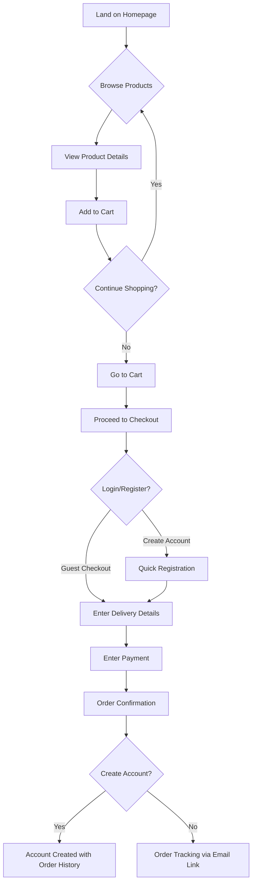
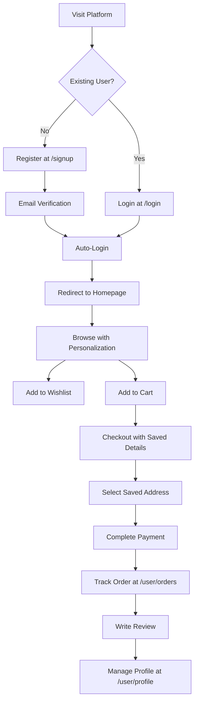
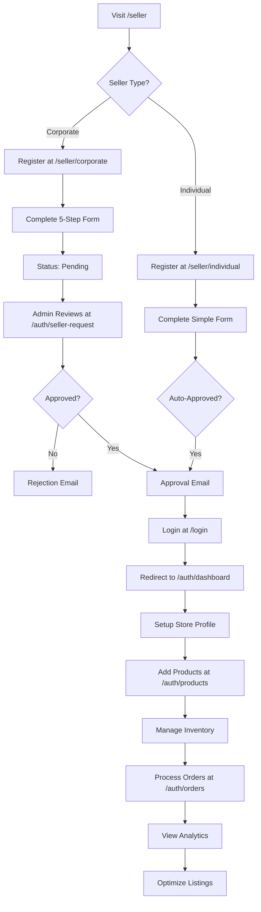

# Authentication Flow PRD - AlabaMart Platform

**Document Version:** 1.0
**Last Updated:** February 16, 2026
**Status:** Current Implementation Documentation & Best Practices

---

## Table of Contents

1. [Executive Summary](#executive-summary)
2. [User Types & Personas](#user-types--personas)
3. [Authentication Methods](#authentication-methods)
4. [User Journey Flows](#user-journey-flows)
5. [Technical Architecture](#technical-architecture)
6. [Security & Compliance](#security--compliance)
7. [User Experience Guidelines](#user-experience-guidelines)
8. [API Endpoints Reference](#api-endpoints-reference)
9. [Implementation Checklist](#implementation-checklist)

---

## 1. Executive Summary

### 1.1 Overview

AlabaMart is a multi-sided marketplace platform that supports three distinct user experiences:
- **Guest Users**: Unauthenticated visitors who can browse and checkout
- **Authenticated Users**: Registered customers who can purchase, track orders, and manage profiles
- **Sellers**: Business entities (individual or corporate) who can list and manage products

### 1.2 Authentication Strategy

The platform employs a **JWT-based authentication** system with NextAuth.js, supporting:
- Email/Password authentication
- Google OAuth (Social Login)
- Phone OTP authentication (Firebase)
- Token refresh mechanism (7-day sessions)
- Role-based access control (RBAC)

### 1.3 Key Design Principles

1. **Frictionless Guest Experience**: Allow shopping without mandatory registration
2. **Progressive Registration**: Convert guests to authenticated users at checkout
3. **Multi-Method Authentication**: Provide flexible login options
4. **Role-Based Routing**: Dynamic redirects based on user type
5. **Security-First**: Token management, secure sessions, and data protection

---

## 2. User Types & Personas

### 2.1 Guest User

**Definition**: Unauthenticated visitor browsing the platform

**Capabilities**:
- ✅ Browse products and categories
- ✅ Search and filter products
- ✅ Add items to cart (stored in localStorage/Redux)
- ✅ Proceed to checkout
- ✅ View product details
- ❌ Cannot save favorites/wishlist
- ❌ Cannot track order history
- ❌ Cannot leave reviews
- ❌ Cannot save delivery addresses

**Conversion Points**:
- Checkout page (optional registration)
- Add to favorites (requires login)
- Review submission (requires login)
- Order tracking (requires login)

---

### 2.2 Authenticated User (Regular Customer)

**Definition**: Registered customer account with verified credentials

**User Properties**:
```typescript
{
  id: number
  type: "user"
  role: null | "user"
  name: string
  email: string
  phone: string
  mail_verify: boolean
  phone_verify: boolean
  status: boolean (active)
}
```

**Capabilities**:
- ✅ All guest capabilities
- ✅ Persistent cart across devices
- ✅ Save multiple delivery addresses
- ✅ Order history and tracking
- ✅ Wishlist/Favorites management
- ✅ Write product reviews
- ✅ Receive notifications
- ✅ Profile management
- ✅ Faster checkout (saved details)

**Dashboard Access**: `/user/*` routes
- `/user/profile` - Account settings
- `/user/orders/[id]` - Order details
- `/user/address` - Manage addresses
- `/user/favorites` - Wishlist
- `/user/notifications` - Notifications

---

### 2.3 Seller User

**Definition**: Business entity (individual or corporate) selling products on the platform

**Seller Types**:


#### 2.3.2 Corporate Seller
**Registration Path**: `/seller/corporate`

**Properties** (Extended):
```typescript
{
  id: number
  type: "seller"
  role: "seller"
  store_id: number
  store_name: string
  business_address: string
  trn_number: string
  logo_upload: string
  status: "pending" | "approved"
  Bank_account:
  NIN:
}
```

**Registration Requirements** (5-Step Process):
1. **Personal Details**: Name, email, phone, country code
2. **Business Information**: Store name, address, location
3. **Legal Documents**: TRN number, 
4. **Owner Verification**: ID proof, DOB, nationality, ID expiry
5. **Branding**: Logo upload, final submission

**Capabilities**:
- ✅ Product listing and management
- ✅ Inventory management
- ✅ Order fulfillment
- ✅ Sales analytics
- ✅ Customer communication
- ✅ Pricing and promotions
- ✅ Store branding

**Dashboard Access**: `/auth/*` routes
- `/auth/dashboard` - Sales overview
- `/auth/products` - Product management
- `/auth/orders` - Order processing
- `/auth/invoices` - Financial records

---

### 2.4 Additional User Types

#### 2.4.1 Delivery Driver
**Registration Path**: `/seller/driver`
```typescript
{
  type: "driver"
  role: "driver"
  driver_id: number
}
```

#### 2.4.2 Delivery Company
**Registration Path**: `/seller/delivery-company`
```typescript
{
  type: "delivery_company"
  role: "delivery_company"
  delivery_company_id: number
}
```

#### 2.4.3 Admin
**System Role**: Platform administrators
```typescript
{
  type: "admin"
  role: "admin"
}
```

**Admin-Only Routes**:
- `/auth/settings` - Platform configuration
- `/auth/categories` - Category management
- `/auth/sellers` - Seller approvals
- `/auth/users` - User management
- `/auth/invoices` - Financial oversight
- `/auth/seller-request` - Seller applications
- `/auth/boost-approvals` - Product boost requests

---

## 3. Authentication Methods

### 3.1 Email/Password Authentication

**Route**: `/login` (emailLogin.tsx)

**Flow**:
```
1. User enters email + password
2. Frontend validates format
3. POST /api/auth/signin with credentials
4. NextAuth CredentialsProvider calls backend
5. Backend POST auth/login
6. Backend validates credentials
7. Returns { data: user, token, refreshToken }
8. JWT callback stores in session
9. Redux stores tokens (authSlice)
10. Redirect based on user type
```

**Validation**:
- Email format validation
- Password minimum length (8 characters recommended)
- Rate limiting on failed attempts

**Error Handling**:
- Invalid credentials
- Account not verified
- Account suspended/deactivated

---

### 3.2 Google OAuth Authentication

**Route**: `/login` (gmailLogin.tsx)

**Implementation**: Firebase Google Authentication

**Flow**:
```
1. User clicks "Continue with Google"
2. Firebase initiates Google OAuth popup
3. User authenticates with Google
4. Firebase returns user + idToken
5. Frontend POST auth/google-login with token
6. Backend verifies Google token
7. Creates/updates user record
8. Returns { data: user, token, refreshToken }
9. Session established
10. Redirect to appropriate dashboard
```

**User Data Captured**:
- Email (verified by Google)
- Name
- Profile photo
- Google UID

**Benefits**:
- Faster onboarding
- Email pre-verified
- Reduced password management
- Higher conversion rate

---

### 3.3 Phone OTP Authentication

**Route**: `/login` (phoneLogin.tsx)

**Implementation**: Firebase Phone Authentication

**Flow**:
```
1. User enters phone number + country code
2. Frontend validates phone format
3. Firebase sends SMS with 6-digit OTP
4. User enters OTP code
5. Firebase verifies OTP
6. Frontend POST auth/phone-login with verified phone
7. Backend creates/finds user by phone
8. Returns { data: user, token, refreshToken }
9. Session established
10. Redirect to appropriate dashboard
```

**Use Cases**:
- Markets with high mobile usage
- Users without email access
- Quick authentication for returning users
- 2FA verification

**Implementation Notes**:
- Requires reCAPTCHA for spam prevention
- OTP expires after 60 seconds
- SMS costs consideration
- Phone verification stored as `phone_verify: true`

---

### 3.4 Registration Flows

#### 3.4.1 Regular User Signup

**Route**: `/signup`

**Required Fields**:
- First name
- Last name
- Email
- Phone + country code
- Password
- Confirm password

**Flow**:
```
1. User fills registration form
2. Frontend validates:
   - Email format and availability (GET auth/checkEmail/)
   - Phone format and availability (GET auth/checkphone/)
   - Password strength and match
3. POST auth/signup
4. Backend creates user record
5. Sends verification email
6. Returns { data: user, token, refreshToken }
7. Auto-login (session created)
8. Redirect to / (homepage)
9. Email verification link sent
```

**Post-Registration**:
- Welcome email sent
- Email verification required for full access
- Optional onboarding flow

---

#### 3.4.2 Seller Registration

**Corporate Seller** (`/seller/corporate`):

**5-Step Registration Process**:

**Step 1: Personal Information**
- First name, last name
- Email, phone, country code
- Password creation

**Step 2: Business Details**
- Store name
- Business address
- Business location (map integration)

**Step 3: Legal Documentation**
- TRN (Tax Registration Number)
- Trade License Number
- UPSCS registration
- Manufacturer details (if applicable)

**Step 4: Owner Verification**
- ID type (passport, national ID, driver's license)
- ID number and upload
- Date of birth
- Birth country and seller country
- ID issue country and expiry date

**Step 5: Branding & Submission**
- Store logo upload
- Terms & conditions acceptance
- Final submission

**Flow**:
```
1. User starts at /seller
2. Selects "Corporate Seller"
3. Completes 5-step form
4. POST coorporate_store/create
5. Status: "pending" (awaiting admin approval)
6. Admin reviews application at /auth/seller-request
7. Admin approves/rejects
8. Email notification sent
9. If approved: status="approved", can login
10. Redirect to /auth/dashboard
```

**Individual Seller** (`/seller/individual`):

**Simplified Registration**:
- Personal details
- Business location and type
- Visa status
- Age, gender, language
- Interest categories

**Flow**:
```
1. User selects "Individual Seller"
2. Completes single-page form
3. POST individual_seller/create
4. Immediate approval (or pending review)
5. Auto-login
6. Redirect to /auth/dashboard
```

---

## 4. User Journey Flows

### 4.1 Guest User Journey



**Key Features**:
1. **No Forced Registration**: Can complete purchase as guest
2. **Cart Persistence**: Cart stored in Redux/localStorage
3. **Post-Purchase Conversion**: Prompt to create account after successful order
4. **Email Order Tracking**: Receive order updates via email
5. **One-Click Registration**: Convert cart and order data to new account

**Technical Implementation**:
```typescript
// Guest checkout allowed routes
middleware.ts: ['/cart', '/checkout', '/checkoutsuccess']

// Cart stored in Redux
Cart slice persists items without authentication

// Conversion at checkout
if (!session) {
  // Show guest checkout option + registration form
  // On registration: merge cart + order to new user
}
```

---

### 4.2 Authenticated User Journey



**Benefits of Authentication**:
1. **Personalized Experience**: Product recommendations based on history
2. **Saved Preferences**: Addresses, payment methods, wishlist
3. **Order History**: Complete purchase records at `/user/orders`
4. **Faster Checkout**: Pre-filled details
5. **Communication**: Notifications and updates
6. **Loyalty Programs**: Points, rewards, exclusive deals

**Protected Routes** (`middleware.ts`):
```typescript
// User routes require authentication
if (pathname.startsWith('/user/')) {
  if (!token) redirect('/login')
}

// Accessible routes:
/user/profile          // Account management
/user/orders/[id]      // Order details
/user/address          // Address book
/user/favorites        // Wishlist
/user/notifications    // Alerts
```

---

### 4.3 Seller User Journey



**Seller Onboarding Checklist**:
1. ✅ Complete registration (individual or corporate)
2. ✅ Await approval (corporate sellers)
3. ✅ Email verification
4. ✅ Login to seller dashboard
5. ✅ Complete store profile
6. ✅ Upload store logo
7. ✅ Add first product
8. ✅ Set up payment/payout details
9. ✅ Configure shipping options
10. ✅ Go live!

**Seller Dashboard Routes** (`/auth/*`):
```typescript
// Seller-accessible routes
/auth/dashboard              // Sales overview, analytics
/auth/products               // Product management (CRUD)
/auth/orders                 // Order fulfillment
/auth/invoices               // Financial records

// Admin reviews corporate sellers
/auth/seller-request         // Pending approvals (admin only)
```

**Seller Capabilities**:
- Product listing with images, variants, pricing
- Inventory management (stock levels)
- Order processing and fulfillment
- Customer communication
- Sales analytics and reports
- Promotional campaigns
- Store branding and customization

---

### 4.4 Cross-Type Transitions

**Guest → Authenticated User**:
```
Trigger: Checkout, Add to Wishlist, Write Review
Action: Show registration modal/page
Result: Merge cart, preserve session, continue action
```

**Authenticated User → Seller**:
```
Scenario: Existing user wants to sell
Flow:
  1. Visit /seller while logged in
  2. Complete seller registration
  3. Backend links seller account to user account
  4. User now has dual access:
     - /user/* routes (as buyer)
     - /auth/* routes (as seller)
  5. Type switching mechanism in header
```

**Implementation**:
```typescript
// Check if user has both buyer and seller roles
if (session.user.type === "seller" && session.user.id) {
  // Show role switcher in navigation
  // Allow access to both /user/* and /auth/*
}
```

---

## 5. Technical Architecture

### 5.1 Authentication Stack

**Framework**: Next.js 14+ with App Router

**Authentication Library**: NextAuth.js v4

**Session Strategy**: JWT (JSON Web Tokens)

**Token Storage**:
- **JWT Tokens**: HTTP-only cookies (NextAuth)
- **Access/Refresh Tokens**: Redux + localStorage (persisted)

**State Management**: Redux Toolkit with Redux Persist

**Backend API**: RESTful API (separate service)

**Third-Party Services**:
- Firebase Authentication (Google OAuth, Phone OTP)
- reCAPTCHA (bot prevention)

---

### 5.2 NextAuth Configuration

**File**: `src/app/api/auth/[...nextauth]/options.ts`

```typescript
export const authOptions: NextAuthOptions = {
  providers: [
    CredentialsProvider({
      name: "Credentials",
      credentials: {
        email: {},
        password: {},
        phone: {},
        loginType: {} // "email", "phone", "google"
      },
      async authorize(credentials) {
        // Route to appropriate backend endpoint
        if (credentials?.loginType === "email") {
          // POST auth/login
        } else if (credentials?.loginType === "phone") {
          // POST auth/phone-login
        } else if (credentials?.loginType === "google") {
          // POST auth/google-login
        }

        // Return user object + tokens
        return { user, token, refreshToken }
      }
    })
  ],

  session: {
    strategy: "jwt",
    maxAge: 7 * 24 * 60 * 60, // 7 days
  },

  callbacks: {
    async jwt({ token, user }) {
      // Initial sign in
      if (user) {
        token.user = user.data
        token.accessToken = user.token
        token.refreshToken = user.refreshToken
      }

      // Check token expiry
      // Implement refresh token logic here

      return token
    },

    async session({ session, token }) {
      // Populate session from token
      session.user = token.user
      session.token = token.accessToken
      session.refreshToken = token.refreshToken
      session.role = token.user?.role
      session.type = token.user?.type

      return session
    }
  },

  pages: {
    signIn: "/login",
    error: "/login", // Error code passed in query string as ?error=
  },

  secret: process.env.NEXTAUTH_SECRET,
}
```

---

### 5.3 Redux State Management

**Auth Slice** (`src/redux/slice/authSlice.ts`):
```typescript
interface AuthState {
  token: string | null
  refreshToken: string | null
}

const authSlice = createSlice({
  name: "Auth",
  initialState: { token: null, refreshToken: null },
  reducers: {
    storeToken: (state, action) => {
      state.token = action.payload.token
      state.refreshToken = action.payload.refreshToken
    },
    clearToken: (state) => {
      state.token = null
      state.refreshToken = null
    }
  }
})
```

**User Slice** (`src/redux/slice/userSlice.ts`):
```typescript
interface UserState {
  user: object
  auth: boolean
}

const userSlice = createSlice({
  name: "User",
  initialState: { user: {}, auth: false },
  reducers: {
    login: (state, action) => {
      state.user = action.payload
      state.auth = true
    },
    logout: (state) => {
      state.user = {}
      state.auth = false
    },
    update: (state, action) => {
      state.user = { ...state.user, ...action.payload }
    }
  }
})
```

**Store Configuration** (`src/redux/store/store.ts`):
```typescript
import { persistStore, persistReducer } from 'redux-persist'
import storage from 'redux-persist/lib/storage' // localStorage

const persistConfig = {
  key: 'root',
  storage,
  whitelist: ['Cart', 'Auth', 'User', 'Category', 'Settings', 'Location', 'Language', 'Checkout', 'paystack']
}

const persistedReducer = persistReducer(persistConfig, rootReducer)

export const store = configureStore({
  reducer: persistedReducer,
  middleware: (getDefaultMiddleware) =>
    getDefaultMiddleware({
      serializableCheck: {
        ignoredActions: [FLUSH, REHYDRATE, PAUSE, PERSIST, PURGE, REGISTER],
      },
    }),
})

export const persistor = persistStore(store)
```

---

### 5.4 Middleware Protection

**File**: `src/middleware.ts`

```typescript
export async function middleware(request: NextRequest) {
  const { pathname } = request.nextUrl
  const token = await getToken({ req: request })

  // Non-authenticated routes (redirect logged-in users)
  const authRoutes = ['/login', '/signup', '/forgot-password']
  if (authRoutes.includes(pathname) && token) {
    return NextResponse.redirect(new URL('/', request.url))
  }

  // Guest-allowed routes
  const guestRoutes = ['/cart', '/checkout', '/checkoutsuccess']
  if (guestRoutes.some(route => pathname.startsWith(route))) {
    return NextResponse.next()
  }

  // User routes (require authentication)
  if (pathname.startsWith('/user/')) {
    if (!token) {
      return NextResponse.redirect(new URL('/login', request.url))
    }
  }

  // Protected routes (sellers, drivers, delivery companies, admin)
  if (pathname.startsWith('/auth/')) {
    const allowedTypes = ["seller", "admin", "delivery_company", "driver"]
    const userType = token?.user?.type
    const userRole = token?.user?.role

    // Admin-only routes
    const adminRoutes = [
      '/auth/settings',
      '/auth/dashboard',
      '/auth/categories',
      '/auth/sellers',
      '/auth/users',
      '/auth/invoices',
      '/auth/seller-request'
    ]

    if (adminRoutes.includes(pathname)) {
      if (userRole !== "admin") {
        return NextResponse.redirect(new URL('/', request.url))
      }
    }

    // General protected routes
    if (!allowedTypes.includes(userType) && !allowedTypes.includes(userRole)) {
      return NextResponse.redirect(new URL('/', request.url))
    }
  }

  return NextResponse.next()
}

export const config = {
  matcher: [
    '/user/:path*',
    '/auth/:path*',
    '/login',
    '/signup',
    '/forgot-password',
    '/cart',
    '/checkout',
    '/checkoutsuccess/:path*'
  ]
}
```

---

### 5.5 API Call Utility with Auto Token Injection

**File**: `src/util/apicall.ts`

```typescript
import { store } from '@/redux/store/store'

const getAuthToken = () => {
  const state = store.getState()
  return state?.Auth?.token
}

export const apicall = {
  get: async (url: string, opts?: { token?: string }) => {
    const token = opts?.token || getAuthToken()
    const response = await fetch(baseURL + url, {
      headers: {
        'Authorization': token ? `Bearer ${token}` : '',
        'Content-Type': 'application/json'
      }
    })
    return response.json()
  },

  post: async (url: string, data: any, opts?: { token?: string }) => {
    const token = opts?.token || getAuthToken()
    const response = await fetch(baseURL + url, {
      method: 'POST',
      headers: {
        'Authorization': token ? `Bearer ${token}` : '',
        'Content-Type': 'application/json'
      },
      body: JSON.stringify(data)
    })
    return response.json()
  },

  // ... PUT, DELETE, PATCH methods
}
```

**Usage**:
```typescript
// Automatically includes token from Redux
const orders = await apicall.get('user/orders')
const profile = await apicall.get('user/profile')

// Or provide custom token
const data = await apicall.get('admin/stats', { token: customToken })
```

---

### 5.6 Token Refresh Mechanism

**Endpoint**: `POST auth/refresh-token`

**Flow**:
```typescript
// In JWT callback
async jwt({ token, user }) {
  // Check if token expired
  const now = Date.now()
  const tokenExpiry = token.exp * 1000 // Convert to milliseconds

  if (now < tokenExpiry) {
    return token // Token still valid
  }

  // Token expired, refresh it
  try {
    const response = await fetch(baseURL + 'auth/refresh-token', {
      method: 'POST',
      headers: { 'Content-Type': 'application/json' },
      body: JSON.stringify({ refreshToken: token.refreshToken })
    })

    const refreshed = await response.json()

    if (refreshed.token) {
      return {
        ...token,
        accessToken: refreshed.token,
        refreshToken: refreshed.refreshToken || token.refreshToken
      }
    }
  } catch (error) {
    console.error('Token refresh failed:', error)
    return null // Force logout
  }

  return null
}
```

**Implementation Best Practices**:
- Refresh token before expiry (e.g., 5 minutes before)
- Implement token rotation (new refresh token on each refresh)
- Handle refresh failures gracefully (logout user)
- Store refresh token securely (httpOnly cookie or encrypted)

---

## 6. Security & Compliance

### 6.1 Security Measures

#### 6.1.1 Password Security
- **Minimum Length**: 8 characters
- **Complexity**: Mix of uppercase, lowercase, numbers, special characters (recommended)
- **Hashing**: bcrypt/Argon2 on backend (never store plaintext)
- **Password Reset**: Time-limited tokens sent to verified email
- **Rate Limiting**: Max 5 failed login attempts before lockout

#### 6.1.2 Token Security
- **JWT Secret**: Strong, environment-variable-based secret
- **Token Expiry**: 7-day sessions (configurable)
- **Refresh Tokens**: Separate, longer-lived tokens for renewal
- **Token Storage**:
  - NextAuth cookies: httpOnly, secure, sameSite
  - Redux tokens: localStorage (encrypted recommended)
- **Token Invalidation**: Logout clears all tokens

#### 6.1.3 Session Management
- **Concurrent Sessions**: Allow multiple devices (track session IDs)
- **Session Timeout**: Auto-logout after 7 days
- **Activity Tracking**: Update last_active timestamp
- **Device Fingerprinting**: Optional for fraud detection

#### 6.1.4 API Security
- **HTTPS Only**: Enforce SSL/TLS in production
- **CORS Policy**: Whitelist allowed origins
- **Rate Limiting**: Per-endpoint request throttling
- **Input Validation**: Sanitize all user inputs (XSS prevention)
- **SQL Injection Prevention**: Parameterized queries/ORM
- **CSRF Protection**: NextAuth handles CSRF tokens

#### 6.1.5 Third-Party Authentication
- **Google OAuth**: Verify ID tokens server-side
- **Firebase**: Validate authentication responses
- **reCAPTCHA**: Prevent bot registrations/logins

---

### 6.2 Data Privacy (GDPR/CCPA)

#### 6.2.1 User Rights
- **Right to Access**: API endpoint to download user data
- **Right to Deletion**: Account deletion removes personal data
- **Right to Rectification**: Profile editing at `/user/profile`
- **Right to Portability**: Export data in JSON format
- **Right to Object**: Opt-out of marketing communications

#### 6.2.2 Consent Management
- **Terms of Service**: Checkbox during registration
- **Privacy Policy**: Link and acceptance required
- **Cookie Consent**: Banner for non-essential cookies
- **Marketing Opt-in**: Separate checkbox for promotional emails

#### 6.2.3 Data Retention
- **Active Users**: Data retained while account active
- **Inactive Users**: Email reminders after 12 months of inactivity
- **Deleted Accounts**: Personal data purged within 30 days
- **Order History**: Financial records retained per legal requirements (7 years)

---

### 6.3 Verification Requirements

#### 6.3.1 Email Verification
**Flow**:
```
1. User registers with email
2. Backend generates verification token (UUID, 24-hour expiry)
3. Email sent with verification link: /verify-email?token=xxx
4. User clicks link
5. POST auth/verify-email with token
6. Backend validates token and marks mail_verify=true
7. User redirected to login or dashboard
```

**Benefits**:
- Prevent fake registrations
- Ensure valid contact method
- Required for password resets

#### 6.3.2 Phone Verification
**Flow**:
```
1. User enters phone number
2. Firebase sends 6-digit OTP via SMS
3. User enters OTP
4. Frontend verifies with Firebase
5. Backend marks phone_verify=true
6. Used for 2FA or phone login
```

**Use Cases**:
- Two-factor authentication
- Phone-based login
- Order/delivery notifications

#### 6.3.3 Seller Verification (Corporate)
**Documents Required**:
- Tax Registration Number (TRN)
- Trade License
- Government-issued ID (owner)
- Business address proof
- Store logo

**Verification Process**:
```
1. Seller submits registration with documents
2. Status: "pending"
3. Admin reviews at /auth/seller-request
4. Admin checks:
   - Document validity
   - Business legitimacy
   - Owner ID verification
5. Admin approves/rejects
6. Status updated to "approved" or "rejected"
7. Email notification sent
8. If approved: Seller can login and start selling
```

---

## 7. User Experience Guidelines

### 7.1 Login/Registration UX

#### 7.1.1 Form Design
- **Single Column Layout**: Easy mobile navigation
- **Clear Labels**: Above input fields
- **Inline Validation**: Real-time feedback (email format, password strength)
- **Error Messages**: Specific and actionable (e.g., "Email already registered")
- **Progress Indicators**: Multi-step forms show current step
- **Auto-Focus**: First input field focused on page load
- **Tab Order**: Logical keyboard navigation

#### 7.1.2 Password Input
- **Show/Hide Toggle**: Eye icon to reveal password
- **Strength Meter**: Visual indicator (weak/medium/strong)
- **Requirements List**: Display password rules upfront
- **Password Manager Support**: Allow autofill

#### 7.1.3 Social Login Buttons
- **Prominent Placement**: Above "OR" divider
- **Branded Buttons**: Use Google logo and colors
- **One-Click Flow**: Minimal steps after OAuth
- **Error Handling**: Clear messages if OAuth fails

#### 7.1.4 Mobile Optimization
- **Large Touch Targets**: Min 44x44px buttons
- **Auto-Zoom Prevention**: `user-scalable=no` on inputs
- **Numeric Keypad**: Phone input triggers numeric keyboard
- **Email Keyboard**: Email input shows @ and .com keys

---

### 7.2 Onboarding Flows

#### 7.2.1 Guest to Registered User
**Trigger**: Checkout page

**Design**:
```
┌─────────────────────────────────────┐
│  Continue as Guest                  │
│  ○ Checkout without creating account│
│                                     │
│  Create an Account                  │
│  ○ Save details for faster checkout│
│                                     │
│  Already have an account? Login     │
└─────────────────────────────────────┘
```

**Benefits Highlighted**:
- Save time on future purchases
- Track orders easily
- Save addresses and payment methods
- Get exclusive deals

#### 7.2.2 New User Onboarding
**Post-Registration Steps**:
1. **Welcome Screen**: "Welcome to AlabaMart, [Name]!"
2. **Profile Completion**: Add avatar, preferences
3. **Tutorial Overlay**: Highlight key features (optional)
4. **First Action Prompt**: "Add your first item to wishlist"

#### 7.2.3 Seller Onboarding
**Post-Approval Steps**:
1. **Welcome Email**: "Your seller account is approved!"
2. **Dashboard Tour**: Guided walkthrough
3. **Setup Checklist**:
   - ☐ Complete store profile
   - ☐ Upload store logo
   - ☐ Add first product
   - ☐ Set up payment details
   - ☐ Configure shipping
4. **First Sale Celebration**: Notification + badge

---

### 7.3 Error Handling & Messaging

#### 7.3.1 Login Errors
| Error | Message | Action |
|-------|---------|--------|
| Invalid credentials | "Email or password incorrect. Please try again." | Retry form |
| Account not found | "No account found with this email. Would you like to sign up?" | Link to /signup |
| Email not verified | "Please verify your email. Resend verification link?" | Resend button |
| Account suspended | "Your account has been suspended. Contact support." | Support link |
| Too many attempts | "Too many failed attempts. Try again in 15 minutes." | Lockout timer |

#### 7.3.2 Registration Errors
| Error | Message | Action |
|-------|---------|--------|
| Email already exists | "This email is already registered. Login instead?" | Link to /login |
| Phone already exists | "This phone number is already registered." | Login link |
| Weak password | "Password must be at least 8 characters with uppercase, lowercase, and numbers." | Retry |
| Network error | "Connection failed. Please check your internet and try again." | Retry button |

#### 7.3.3 Session Expiry
**Flow**:
```
1. User action triggers API call
2. Backend returns 401 Unauthorized (token expired)
3. Frontend shows modal:
   "Your session has expired. Please login again to continue."
4. Redirect to /login with returnUrl parameter
5. After login, redirect back to original page
```

---

### 7.4 Accessibility (WCAG 2.1 AA)

#### 7.4.1 Keyboard Navigation
- All interactive elements focusable via Tab
- Enter key submits forms
- Escape key closes modals
- Skip to main content link

#### 7.4.2 Screen Reader Support
- Semantic HTML (form, label, button)
- ARIA labels for icons and complex UI
- Error announcements via aria-live
- Form field descriptions via aria-describedby

#### 7.4.3 Visual Accessibility
- Color contrast ratio: Min 4.5:1 for text
- Focus indicators on all interactive elements
- Text size: Min 16px body text
- Responsive scaling up to 200%

#### 7.4.4 Error Prevention
- Confirmation dialogs for destructive actions
- Undo functionality where possible
- Auto-save drafts (e.g., seller product listings)

---

## 8. API Endpoints Reference

### 8.1 Authentication Endpoints

```
Base URL: https://api.alabamart.com/
```

#### POST /auth/signup
**Description**: Register a new regular user

**Request Body**:
```json
{
  "first_name": "John",
  "last_name": "Doe",
  "email": "john@example.com",
  "phone": "1234567890",
  "countrycode": "+234",
  "password": "SecurePass123!",
  "confirm_password": "SecurePass123!"
}
```

**Response**:
```json
{
  "success": true,
  "message": "Registration successful",
  "data": {
    "id": 123,
    "name": "John Doe",
    "email": "john@example.com",
    "type": "user",
    "mail_verify": false
  },
  "token": "eyJhbGciOiJIUzI1NiIsInR5cCI6IkpXVCJ9...",
  "refreshToken": "eyJhbGciOiJIUzI1NiIsInR5cCI6IkpXVCJ9..."
}
```

**Errors**:
- `400`: Validation failed (email/phone already exists, weak password)
- `500`: Server error

---

#### POST /auth/login
**Description**: Login with email and password

**Request Body**:
```json
{
  "email": "john@example.com",
  "password": "SecurePass123!"
}
```

**Response**:
```json
{
  "success": true,
  "message": "Login successful",
  "data": {
    "id": 123,
    "name": "John Doe",
    "email": "john@example.com",
    "phone": "1234567890",
    "type": "user",
    "role": null,
    "mail_verify": true,
    "phone_verify": true,
    "status": true,
    "image": "https://cdn.alabamart.com/profiles/123.jpg"
  },
  "token": "eyJhbGciOiJIUzI1NiIsInR5cCI6IkpXVCJ9...",
  "refreshToken": "eyJhbGciOiJIUzI1NiIsInR5cCI6IkpXVCJ9..."
}
```

**Errors**:
- `401`: Invalid credentials
- `403`: Account not verified or suspended
- `500`: Server error

---

#### POST /auth/phone-login
**Description**: Login with verified phone number

**Request Body**:
```json
{
  "phone": "1234567890",
  "countrycode": "+234"
}
```

**Response**: Same as /auth/login

---

#### POST /auth/google-login
**Description**: Login with Google OAuth token

**Request Body**:
```json
{
  "idToken": "google-firebase-id-token",
  "email": "john@example.com",
  "name": "John Doe",
  "image": "https://lh3.googleusercontent.com/..."
}
```

**Response**: Same as /auth/login

---

#### POST /auth/refresh-token
**Description**: Refresh expired access token

**Request Body**:
```json
{
  "refreshToken": "eyJhbGciOiJIUzI1NiIsInR5cCI6IkpXVCJ9..."
}
```

**Response**:
```json
{
  "success": true,
  "token": "new-access-token",
  "refreshToken": "new-refresh-token"
}
```

**Errors**:
- `401`: Invalid or expired refresh token
- `500`: Server error

---

#### POST /auth/verify-email
**Description**: Verify user email address

**Request Body**:
```json
{
  "token": "email-verification-token-uuid"
}
```

**Response**:
```json
{
  "success": true,
  "message": "Email verified successfully"
}
```

**Errors**:
- `400`: Invalid or expired token
- `404`: Token not found

---

#### POST /auth/forgot-password
**Description**: Request password reset

**Request Body**:
```json
{
  "email": "john@example.com"
}
```

**Response**:
```json
{
  "success": true,
  "message": "Password reset email sent"
}
```

---

#### POST /auth/reset-password
**Description**: Reset password with token

**Request Body**:
```json
{
  "token": "reset-token-uuid",
  "password": "NewSecurePass123!",
  "confirm_password": "NewSecurePass123!"
}
```

**Response**:
```json
{
  "success": true,
  "message": "Password reset successful"
}
```

---

#### GET /auth/checkEmail/:email
**Description**: Check if email is available for registration

**Response**:
```json
{
  "available": true
}
```

---

#### GET /auth/checkphone/:phone
**Description**: Check if phone is available

**Response**:
```json
{
  "available": false,
  "message": "Phone number already registered"
}
```

---

#### GET /auth/signout/:userId
**Description**: Logout user and invalidate tokens

**Headers**: `Authorization: Bearer {token}`

**Response**:
```json
{
  "success": true,
  "message": "Logged out successfully"
}
```

---

### 8.2 Seller Registration Endpoints

#### POST /coorporate_store/create
**Description**: Register a corporate seller

**Request Body**:
```json
{
  "first_name": "Jane",
  "last_name": "Smith",
  "email": "jane@company.com",
  "phone": "1234567890",
  "countrycode": "+234",
  "password": "SecurePass123!",
  "store_name": "ABC Electronics Ltd",
  "business_address": "123 Business St, Lagos",
  "business_location": "Lagos, Nigeria",
  "trn_number": "TRN123456",
  "trade_lisc_no": "TL789012",
  "upscs": "UPSCS345678",
  "manufacture": "Yes",
  "seller_name": "Jane Smith",
  "seller_country": "Nigeria",
  "birth_country": "Nigeria",
  "dob": "1985-05-15",
  "id_type": "passport",
  "id_proof": "passport-file-url",
  "id_issue_country": "Nigeria",
  "id_expiry_date": "2030-05-15",
  "logo_upload": "logo-file-url",
  "status": "pending"
}
```

**Response**:
```json
{
  "success": true,
  "message": "Corporate seller registration submitted. Pending admin approval.",
  "data": {
    "id": 456,
    "type": "seller",
    "store_id": 789,
    "status": "pending"
  }
}
```

---

#### POST /individual_seller/create
**Description**: Register an individual seller

**Request Body**:
```json
{
  "name": "John Doe",
  "email": "john@seller.com",
  "phone": "1234567890",
  "countrycode": "+234",
  "password": "SecurePass123!",
  "business_location": "Lagos",
  "business_type": "Retail",
  "visa_status": "Citizen",
  "age": 35,
  "gender": "Male",
  "language": "English",
  "interest": "Electronics"
}
```

**Response**:
```json
{
  "success": true,
  "message": "Individual seller registration successful",
  "data": {
    "id": 457,
    "type": "seller",
    "store_id": 790,
    "status": "approved"
  },
  "token": "...",
  "refreshToken": "..."
}
```

---

### 8.3 Delivery/Driver Endpoints

#### POST /delivery/company/register
**Description**: Register a delivery company

**Request Body**:
```json
{
  "company_name": "Express Deliveries Ltd",
  "email": "info@express.com",
  "phone": "1234567890",
  "address": "456 Logistics Ave",
  "registration_number": "RC123456",
  "password": "SecurePass123!"
}
```

**Response**:
```json
{
  "success": true,
  "message": "Delivery company registered",
  "data": {
    "id": 678,
    "type": "delivery_company",
    "delivery_company_id": 890
  },
  "token": "...",
  "refreshToken": "..."
}
```

---

#### POST /delivery/driver/register
**Description**: Register a delivery driver

**Request Body**:
```json
{
  "name": "Mike Driver",
  "email": "mike@driver.com",
  "phone": "1234567890",
  "license_number": "DL789012",
  "vehicle_type": "Motorcycle",
  "password": "SecurePass123!"
}
```

**Response**:
```json
{
  "success": true,
  "message": "Driver registered",
  "data": {
    "id": 789,
    "type": "driver",
    "driver_id": 901
  },
  "token": "...",
  "refreshToken": "..."
}
```

---

## 9. Implementation Checklist

### 9.1 Phase 1: Core Authentication (Week 1-2)

**Backend**:
- [ ] User database schema with type/role fields
- [ ] Password hashing with bcrypt/Argon2
- [ ] JWT token generation (access + refresh)
- [ ] Email/password login endpoint
- [ ] User registration endpoint
- [ ] Token refresh endpoint
- [ ] Logout endpoint
- [ ] Email verification system
- [ ] Password reset flow

**Frontend**:
- [ ] NextAuth.js configuration
- [ ] Login page with email/password form
- [ ] Registration page with validation
- [ ] Redux Auth + User slices
- [ ] Redux persist setup
- [ ] API utility with token injection
- [ ] Middleware for route protection
- [ ] Session provider wrapper
- [ ] Error handling and messaging

---

### 9.2 Phase 2: Social & Phone Auth (Week 3)

**Firebase Setup**:
- [ ] Firebase project configuration
- [ ] Google OAuth credentials
- [ ] Phone authentication setup
- [ ] reCAPTCHA configuration

**Frontend**:
- [ ] Google OAuth button and flow
- [ ] Firebase Google sign-in integration
- [ ] Phone login UI with country code selector
- [ ] OTP input component
- [ ] Firebase phone verification
- [ ] Backend integration for social/phone login

---

### 9.3 Phase 3: User Types & Roles (Week 4-5)

**Seller Features**:
- [ ] Seller registration pages (individual + corporate)
- [ ] Multi-step corporate form with validation
- [ ] Document upload functionality
- [ ] Admin approval workflow
- [ ] Seller dashboard routes
- [ ] Product management pages
- [ ] Order management pages

**User Dashboard**:
- [ ] User profile page
- [ ] Order history page
- [ ] Address management
- [ ] Wishlist/favorites
- [ ] Notifications page

**Access Control**:
- [ ] Middleware type/role checks
- [ ] Admin-only route protection
- [ ] Seller-only route protection
- [ ] User-only route protection

---

### 9.4 Phase 4: Guest Experience (Week 6)

**Guest Checkout**:
- [ ] Cart without authentication
- [ ] Guest checkout flow
- [ ] Guest order tracking via email
- [ ] Post-purchase account creation prompt
- [ ] Cart/order migration to new account

**Conversion Optimization**:
- [ ] Login/register modals on key actions
- [ ] Benefits messaging for registration
- [ ] Social proof (reviews, ratings)
- [ ] Trust badges and security indicators

---

### 9.5 Phase 5: Security & Polish (Week 7-8)

**Security Hardening**:
- [ ] Rate limiting on auth endpoints
- [ ] CSRF protection verification
- [ ] XSS sanitization
- [ ] SQL injection prevention audit
- [ ] Token expiry and refresh testing
- [ ] Concurrent session handling
- [ ] Account lockout after failed attempts
- [ ] Security headers (HSTS, CSP, etc.)

**UX Enhancements**:
- [ ] Loading states and skeleton screens
- [ ] Smooth transitions and animations
- [ ] Mobile responsiveness testing
- [ ] Accessibility audit (WCAG 2.1 AA)
- [ ] Error message refinement
- [ ] Success feedback (toasts, notifications)
- [ ] Onboarding flows
- [ ] Help tooltips and documentation

**Testing**:
- [ ] Unit tests for auth utilities
- [ ] Integration tests for login/register flows
- [ ] E2E tests for user journeys
- [ ] Security penetration testing
- [ ] Load testing for auth endpoints
- [ ] Cross-browser compatibility testing

---

### 9.6 Phase 6: Analytics & Monitoring (Week 9)

**Tracking**:
- [ ] User registration events
- [ ] Login/logout events
- [ ] Social login conversions
- [ ] Guest-to-user conversion rate
- [ ] Seller registration funnel
- [ ] Failed login attempts tracking

**Monitoring**:
- [ ] Error logging (Sentry, LogRocket)
- [ ] Performance monitoring (Vercel Analytics)
- [ ] API latency tracking
- [ ] Token refresh success rate
- [ ] Session duration analytics

---

## 10. Appendix

### 10.1 Environment Variables

```bash
# NextAuth
NEXTAUTH_URL=https://alabamart.com
NEXTAUTH_SECRET=your-secure-random-secret-32-chars-min

# Backend API
NEXT_PUBLIC_API_BASE_URL=https://api.alabamart.com/

# Firebase (for Google OAuth and Phone Auth)
NEXT_PUBLIC_FIREBASE_API_KEY=your-firebase-api-key
NEXT_PUBLIC_FIREBASE_AUTH_DOMAIN=your-app.firebaseapp.com
NEXT_PUBLIC_FIREBASE_PROJECT_ID=your-project-id
NEXT_PUBLIC_FIREBASE_APP_ID=your-app-id

# reCAPTCHA
NEXT_PUBLIC_RECAPTCHA_SITE_KEY=your-recaptcha-site-key
RECAPTCHA_SECRET_KEY=your-recaptcha-secret-key

# Email Service (for verification emails)
EMAIL_SERVICE_API_KEY=your-email-service-key
EMAIL_FROM=noreply@alabamart.com

# Session
SESSION_MAX_AGE=604800 # 7 days in seconds
```

---

### 10.2 Database Schema (Reference)

**users table**:
```sql
CREATE TABLE users (
  id SERIAL PRIMARY KEY,
  first_name VARCHAR(100),
  last_name VARCHAR(100),
  username VARCHAR(100) UNIQUE,
  email VARCHAR(255) UNIQUE NOT NULL,
  phone VARCHAR(20) UNIQUE,
  countrycode VARCHAR(10),
  password_hash VARCHAR(255) NOT NULL,
  type VARCHAR(50) DEFAULT 'user', -- 'user', 'seller', 'driver', 'delivery_company', 'admin'
  role VARCHAR(50), -- 'admin', 'seller', 'driver', 'delivery_company'
  mail_verify BOOLEAN DEFAULT FALSE,
  phone_verify BOOLEAN DEFAULT FALSE,
  status BOOLEAN DEFAULT TRUE,
  image VARCHAR(500),
  store_id INT, -- Foreign key to stores table
  driver_id INT, -- Foreign key to drivers table
  delivery_company_id INT, -- Foreign key to delivery_companies table
  created_at TIMESTAMP DEFAULT NOW(),
  updated_at TIMESTAMP DEFAULT NOW(),
  last_login TIMESTAMP
);
```

**stores table** (for sellers):
```sql
CREATE TABLE stores (
  id SERIAL PRIMARY KEY,
  user_id INT REFERENCES users(id),
  store_name VARCHAR(255) NOT NULL,
  business_address TEXT,
  business_location VARCHAR(255),
  trn_number VARCHAR(100),
  trade_lisc_no VARCHAR(100),
  upscs VARCHAR(100),
  manufacture VARCHAR(50),
  logo_upload VARCHAR(500),
  status VARCHAR(50) DEFAULT 'pending', -- 'pending', 'approved', 'rejected'
  created_at TIMESTAMP DEFAULT NOW()
);
```

**refresh_tokens table**:
```sql
CREATE TABLE refresh_tokens (
  id SERIAL PRIMARY KEY,
  user_id INT REFERENCES users(id),
  token VARCHAR(500) UNIQUE NOT NULL,
  expires_at TIMESTAMP NOT NULL,
  created_at TIMESTAMP DEFAULT NOW()
);
```

---

### 10.3 Future Enhancements

#### Phase 2 Features (Post-MVP):
1. **Two-Factor Authentication (2FA)**:
   - SMS OTP for sensitive actions
   - Authenticator app support (Google Authenticator, Authy)
   - Backup codes generation

2. **Biometric Authentication**:
   - Face ID / Touch ID for mobile apps
   - WebAuthn for passwordless login

3. **Social Login Expansion**:
   - Facebook Login
   - Apple Sign-In
   - Twitter/X OAuth

4. **Advanced Seller Features**:
   - Sub-accounts for team members
   - Role-based permissions within stores
   - Multi-store management for sellers

5. **Guest User Enhancements**:
   - Guest cart sync across devices (cookie/fingerprint)
   - Guest order tracking improvements
   - One-click account creation from order confirmation

6. **Security Enhancements**:
   - Device recognition and alerts
   - Login location tracking
   - Suspicious activity detection
   - IP-based access restrictions

7. **Analytics Dashboard**:
   - User login patterns
   - Registration funnel optimization
   - Cohort analysis (guest vs registered conversion)
   - Seller approval metrics

---

## Document Change Log

| Version | Date | Author | Changes |
|---------|------|--------|---------|
| 1.0 | Feb 16, 2026 | System Analysis | Initial PRD creation based on codebase exploration |

---

## Glossary

- **JWT (JSON Web Token)**: Compact, URL-safe token for representing claims between parties
- **NextAuth**: Authentication library for Next.js applications
- **OAuth**: Open standard for access delegation (used for Google login)
- **OTP (One-Time Password)**: Temporary code sent via SMS for authentication
- **RBAC (Role-Based Access Control)**: Permission system based on user roles
- **Redux**: State management library for JavaScript apps
- **Session**: Period of authenticated interaction between user and platform
- **Token Refresh**: Process of obtaining new access token using refresh token
- **2FA (Two-Factor Authentication)**: Security process requiring two forms of verification

---

**End of Document**

For questions or suggestions, contact the development team at dev@alabamart.com.
